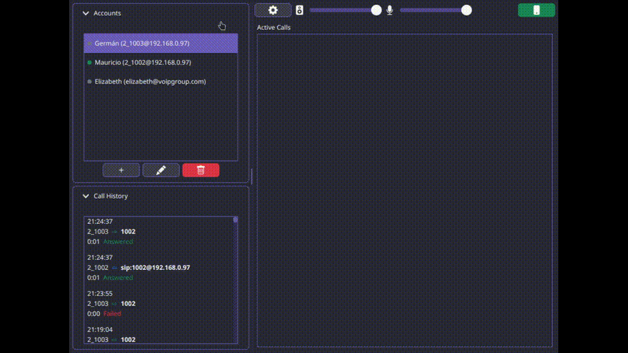

# JSoftSIP

Multi-account JavaFX SIP softphone

## Description

JSoftSIP is a desktop tool for making SIP calls using multiple simultaneous accounts. Its primary purpose is to serve as a testing instrument for SIP infrastructures and as a mechanism for validating accounts and connectivity in Voice-over-IP environments.

<p align="center">
  
</p>

## Architecture Overview

The project is organized into five modules:

- **core**: Domain models, service contracts, call state machine, and SQLite persistence
- **native-bridge**: Communication with the SIP backend (Baresip) via control TCP, native video transport, and audio engine configuration
- **ui**: User interface with JavaFX, FXML controllers, dialogs, and visual themes
- **launcher**: Application entry point, context assembly, and backend resolution
- **packager**: Module that generates distributable packages using the `linux` `jpackage` profile

## Requirements

- JDK 21 or higher
- Maven 3.9 or higher
- Linux operating system
- Baresip installed on the system (external dependency, not included in the package)
  - Default module path: `/usr/lib/baresip/modules`
  - Override with: `-Djsoftsip.baresip.module.path=/path/to/baresip/modules`

## Installation

Clone the repository and build from source:

```bash
git clone <repository-url>
cd jsoftsip
mvn clean install
```

## Usage

### Running from source

```bash
mvn -pl launcher javafx:run
```

### Account registration

1. Open the accounts dialog from the top toolbar
2. Fill in the SIP account details (username, domain, transport, etc.)
3. Save the account; it will appear in the list with a disconnected status
4. Right-click the account in the list and select the register option to connect it to the SIP server

### Making calls

1. Select a registered account in the side panel
2. Open the dialer (phone button in the top toolbar)
3. Enter the destination and press call
4. During an active call, you can hold, resume, mute, or hang up

## Packaging

The project includes a Maven profile for generating self-contained packages using `jpackage`:

```bash
mvn clean package -Plinux -DskipTests
```

This generates the file:

```
packager/target/JSoftSIP-0.0.1-linux-x64.tar.gz
```

The compressed archive contains an application image with a trimmed JVM via `jlink`. Baresip **is not included** in the package; it must be installed on the target system.

> **Note on native image**: An attempt was made to generate a native image with GraalVM, which was not successful due to incompatibilities between JavaFX and the native-image JNI runtime. For more details, see [`docs/native-image-attempt.md`](docs/native-image-attempt.md).

## Testing

Run the full test suite:

```bash
mvn test
```

To run tests for a specific module (use `-am` so Maven also builds required dependencies, such as `core`):

```bash
mvn test -pl core -am
mvn test -pl native-bridge -am
mvn test -pl ui -am
mvn test -pl launcher -am
```

## Code Formatting

Java source code is formatted with Spotless (Eclipse formatter profile). Apply the formatting before committing and use the check goal in CI:

```bash
mvn spotless:apply
mvn spotless:check
```

See [`docs/build-and-package.md`](docs/build-and-package.md) for details.

## Additional Documentation

- [`docs/architecture.md`](docs/architecture.md) — Architecture description, modules, and design principles
- [`docs/features.md`](docs/features.md) — Main softphone features
- [`docs/build-and-package.md`](docs/build-and-package.md) — Build and packaging guide
- [`docs/testing.md`](docs/testing.md) — Test execution guide
- [`docs/native-image-attempt.md`](docs/native-image-attempt.md) — Record of the native image generation attempt

## License

This project is licensed under the [BSD 3-Clause License](LICENSE).